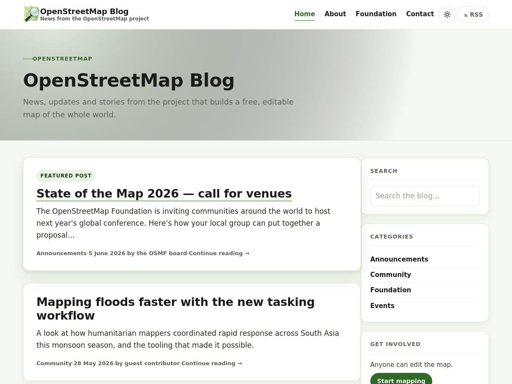

# OSM Blog — WordPress theme (modernised)

A light, fast, accessible WordPress theme for **[blog.openstreetmap.org](https://blog.openstreetmap.org/)**, the main OpenStreetMap blog run by the Foundation.

This is the original `osmblog-wp-theme` (a lightly-customised *Twenty Twelve*) **restyled in place** — same OpenStreetMap identity and the same WordPress structure underneath, but with a modern, card-based layout inspired by [opensource.guide](https://opensource.guide/). Because the template logic, text domain, widgets, menus, post formats and comments are all unchanged, **your existing posts, pages, settings and widgets keep working** when you switch to it.

> **Upstream / official repo:** <https://github.com/osmfoundation/osmblog-wp-theme>

---

## Table of contents

1. [What we did (summary)](#1-what-we-did-summary)
2. [Features](#2-features)
3. [What changed, file by file](#3-what-changed-file-by-file)
4. [Install & activate — keeping all your data](#4-install--activate--keeping-all-your-data)
5. [Staging — test it safely before going live](#5-staging--test-it-safely-before-going-live)
6. [GitHub tutorial — upload to *your* GitHub (browser only)](#6-github-tutorial--upload-to-your-github-browser-only)
7. [Send it to the OSM Foundation (fork & pull request)](#7-send-it-to-the-osm-foundation-fork--pull-request)
8. [Rollback](#8-rollback)
9. [Credits & licence](#9-credits--licence)

---

## 1. What we did (summary)

| Decision | Choice |
|---|---|
| Approach | **Restyle in place** — keep OSM branding & colours, modernise layout + code |
| Scope | Keep it **OSM-specific** (for blog.openstreetmap.org), not a generic base |
| Design reference | [opensource.guide](https://opensource.guide/) — airy, card-based, friendly |
| Goal | **Fast & lightweight** but next-generation design, still installable in WordPress |
| Compatibility | Same `twentytwelve` text domain & template structure → **no data loss** |

In short: the blog now has a clean sticky header (OSM logo + title + menu + RSS), a welcoming hero on the home page, posts presented as cards with a subtle hover-lift, a comfortable reading column, and an OSM-green "route line" motif as the signature. No new web-fonts were added, and the old IE/legacy block CSS was dropped, so pages are lighter than before.

---

## 2. Features

**Design**

- **Modern card layout** — each post sits in a white card with a soft shadow and a gentle lift on hover, the way opensource.guide presents its guides.
- **Sticky site header** — OSM logo, blog title + tagline, the primary menu, and an RSS pill, all in one clean bar that stays in reach as you scroll.
- **Home hero** — a short welcome band with a faint topographic "contour-line" texture, shown only on the first page of the blog.
- **Signature motif: map "route" lines** — an OSM-green underline draws itself under links and post titles on hover (a path being traced on a map). It's the one bold flourish; everything else stays quiet.
- **Comfortable reading** — larger 17px body text, a ~44rem reading measure on single posts, and tidy styling for quotes, code, tables, captions, galleries and images.
- **Dark / light mode switch** — a sun/moon button in the header. It follows the visitor's system setting by default, lets them override it, remembers the choice (in their browser), and sets the theme before the page paints so there's no flash.

**Brand & colour**

- OSM logo green `#7EBC6F` as the single accent, with an accessible darker green `#2E6B27` for links/text on white and `#1D4A18` for hover.
- A barely-there green-tinted off-white canvas (`#F6F8F3`) that nods to map margins without being a generic cream.

**Performance & quality**

- **No external requests** — keeps the already-bundled, self-hosted **Open Sans**; adds no Google Fonts and no icon libraries (the RSS icon is inline SVG).
- **Lighter front end** — the legacy Twenty Twelve `blocks.css` is no longer enqueued (WordPress core still styles block layout), and dead IE-only markup was removed from the header.
- **Modern, lean CSS** — ~480 lines using CSS custom properties, Flexbox/Grid, and a `clamp()` type scale (down from the old ~1,850-line stylesheet).
- **Accessible** — visible keyboard focus rings, a skip-to-content link, `prefers-reduced-motion` support, semantic landmarks, and AA-contrast text.
- **Responsive** — two columns on desktop, single column with a collapsing hamburger menu on mobile.
- **Translation-ready & RTL-ready** — keeps the `twentytwelve` text domain, the bundled `.po/.mo` files, and the RTL stylesheet.

---

## 3. What changed, file by file

Only the visual layer and the header/footer markup were touched. **All loop logic, functions, hooks and widget areas were left intact**, which is what keeps your content safe.

| File | Change |
|---|---|
| `style.css` | **Rewritten** — new modern, lightweight stylesheet with a full **dark-mode** palette (kept the theme header block, **Version 2.1**, kept `Text Domain: twentytwelve`). |
| `header.php` | **Rewritten** — real sticky header (logo + title + menu + **dark/light toggle** + RSS) + home hero; an early no-flash theme script in `<head>`; removed dead IE7/IE8 markup; added a skip link. |
| `footer.php` | **Rewritten** — modern footer with OSM attribution + CC BY-SA note; kept the `twentytwelve_credits` hook and the privacy-policy link. |
| `sidebar.php` | **Simplified** — the logo/RSS moved to the header, so the sidebar now only renders the widget area (`sidebar-1`). |
| `js/theme-toggle.js` | **New** — wires up the dark/light button (persists the choice, respects the system setting). |
| `functions.php` | **Edits** — enqueues `theme-toggle.js`; bumped the stylesheet cache version; stopped enqueuing legacy `blocks.css`. Everything else unchanged. |
| `screenshot.png` | **Replaced** with a render of the new design (1200×900). |
| `CHANGELOG.md` | **New** — version history. |
| everything else | **Unchanged** — `content*.php`, `single.php`, `page.php`, `archive.php`, `comments.php`, `inc/`, `js/navigation.js`, `fonts/`, `languages/`, `images/`, etc. |

> The original files are preserved in the upstream repo's history, and you also still have your original `osmblog-wp-theme-master.zip`.

---

## 4. Install & activate — keeping all your data

**Your posts and pages live in the WordPress *database*, not in the theme.** Switching themes never deletes posts, pages, comments, media or users. The only things tied to a theme are **menus assigned to theme locations** and **widgets assigned to sidebars** — and because this theme keeps the *same* menu location (`primary`) and the *same* sidebar IDs (`sidebar-1/2/3`) as before, those reconnect automatically too.

Two safe ways to install, **all in the browser**:

### Option A — Upload the ZIP (simplest)

1. Log in to **WordPress Admin** → **Appearance → Themes**.
2. Click **Add New Theme → Upload Theme**.
3. Choose `osmblog-wp-theme.zip` and click **Install Now**.
4. **Don't click "Activate" yet** if this is the live site — test on staging first (see §5). On a staging site, click **Activate**.

### Option B — Live Preview first (zero risk)

1. After **Install Now**, click **Live Preview** instead of Activate.
2. The Customizer opens showing your real content in the new theme, **without** changing what visitors see.
3. Check the home page, a single post, an archive, and the menu. If happy, click **Publish/Activate** at the top.

### After activating — 2-minute checklist

- **Appearance → Menus**: confirm your menu is still assigned to **"Primary Menu."** (It should be; re-tick it if not.)
- **Appearance → Widgets**: confirm your sidebar widgets are still in **"Main Sidebar."**
- Open the **home page**, **one post**, and an **archive/category** page and glance over them.
- Hard-refresh once (`Ctrl/Cmd + Shift + R`) so the new CSS loads instead of a cached copy.

That's it — nothing else needs migrating.

---

## 5. Staging — test it safely before going live

"Staging" means a private copy of your site where you can activate and poke at the new theme **without** affecting real visitors. Pick whichever matches your setup — **all browser-based, no command line:**

### Path 1 — Host's 1-click staging (recommended if available)
Many WordPress hosts (e.g. SiteGround, Kinsta, WP Engine, Cloudways, many cPanel hosts) have a **"Staging"** button:

1. In your hosting dashboard, find **Staging** (sometimes under *WordPress Tools* or *Site Tools*).
2. Click **Create staging copy**. The host clones your site to a private URL like `staging.yourblog.org`.
3. Log in to the **staging** admin, install + activate the new theme there (§4), and test thoroughly.
4. When satisfied, either repeat the install on production, or use the host's **"Push to Live"** button.

### Path 2 — Staging plugin (works on almost any host)
If your host has no staging button, use a plugin — entirely from the WordPress admin:

1. **Plugins → Add New**, search **"WP Staging"**, then **Install → Activate**.
2. Open **WP Staging → Create new staging site**, give it a name, click **Start**.
3. Log in to the generated staging site, install + activate the theme, and test.

### Path 3 — Local copy on your own computer
Prefer offline? Install **[Local](https://localwp.com/)** (a free desktop app), import a copy of the site (e.g. via the **All-in-One WP Migration** plugin's export/import — both done through the browser/app UI), then test the theme there.

**What to test on staging:** home page, a long post with images/quotes/code, a page, a category/tag archive, search results, the 404 page, the comment form, the mobile menu (resize the window narrow), and keyboard navigation (press **Tab** and check the focus outline + skip link).

---

## 6. GitHub tutorial — upload to *your* GitHub (browser only)

You'll put this theme in your **own** GitHub account first. No Git, no terminal — just the GitHub website.

### Step 1 — Create a GitHub account (skip if you have one)
Go to <https://github.com> → **Sign up** → follow the prompts → verify your email.

### Step 2 — Create a new repository
1. Top-right **+** → **New repository**.
2. **Repository name:** `osmblog-wp-theme` (or `osmblog-wp-theme-modern`).
3. **Description:** "Modernised WordPress theme for blog.openstreetmap.org."
4. Choose **Public**.
5. Tick **Add a README file** (you can overwrite it later), and set **Licence → GNU General Public License v2.0**.
6. Click **Create repository**.

### Step 3 — Upload the theme files
1. On the repo page, click **Add file → Upload files**.
2. Open the unzipped theme folder on your computer and **drag every file and folder** (`style.css`, `header.php`, the `css/`, `fonts/`, `images/`, `inc/`, `js/`, `languages/`, `page-templates/` folders, etc.) into the upload box.
   - Tip: drag the **contents** of the theme folder, not the folder itself, so files sit at the repo root.
3. Scroll down to **Commit changes**. In the message box write something like:
   `Modernise OSM blog theme: card layout, sticky header, lighter CSS (v2.0)`
4. Click **Commit changes**. GitHub uploads everything.

### Step 4 — Replace the README (optional)
Open `README.md` in the repo → pencil **✎ Edit** → paste this file's contents → **Commit changes**.

You now have your work on GitHub at `https://github.com/<your-username>/osmblog-wp-theme`. 🎉

> **Heads-up about large folders:** the `fonts/` folder has many files. If a drag-and-drop upload times out, upload it in two goes (e.g. upload `fonts/` on its own first, then the rest), or use **Add file → Upload files** repeatedly. Each upload is its own commit, which is fine.

---

## 7. Send it to the OSM Foundation (fork & pull request)

The Foundation maintains the live theme at **[osmfoundation/osmblog-wp-theme](https://github.com/osmfoundation/osmblog-wp-theme)**. The way to propose your redesign is a **fork + pull request** — again, **all in the browser.**

> Before investing effort, it's polite to **open an issue first** describing the redesign and linking your screenshot, so maintainers can say whether they'd welcome it. Issues: <https://github.com/osmfoundation/osmblog-wp-theme/issues>.

### Step 1 — Fork the upstream repo
1. Go to <https://github.com/osmfoundation/osmblog-wp-theme>.
2. Click **Fork** (top-right) → **Create fork**. You now have `https://github.com/<your-username>/osmblog-wp-theme` that is *linked* to the original.

### Step 2 — Put your changes into the fork
Easiest browser-only route — edit the fork directly:
1. In **your fork**, click **Add file → Upload files** and upload your modified files: `style.css`, `header.php`, `footer.php`, `sidebar.php`, `functions.php`, `screenshot.png`, `README.md`, `CHANGELOG.md` at the repo root, and `theme-toggle.js` inside the **`js/`** folder (open the `js` folder first, then upload). Uploading a file with the same path **replaces** it.
2. **Important — commit to a new branch, not `master`:** at the **Commit changes** step choose **"Create a new branch for this commit and start a pull request."** Name the branch e.g. `modern-redesign`.
3. Click **Propose changes**.

### Step 3 — Open the pull request
1. GitHub shows a **"Comparing changes"** screen: base = `osmfoundation/osmblog-wp-theme : master`, head = `your-fork : modern-redesign`.
2. Click **Create pull request**.
3. Give it a clear title, e.g. **"Modernise the blog theme (card layout, lighter CSS) — keeps all content"**, and in the description explain:
   - what changed and why (link this README's §1–§3),
   - that it **keeps the `twentytwelve` text domain, menus and widget areas**, so no content/setup is lost,
   - that it adds **no external requests** and **drops legacy CSS**,
   - attach the **before/after screenshot**.
4. Click **Create pull request**.

### Step 4 — Respond to review
Maintainers may ask for tweaks. To update the PR, just upload corrected files to the **same branch** in your fork (**Add file → Upload files → commit to `modern-redesign`**); the PR updates automatically. Be patient and friendly — this is a volunteer project.

> **Note on `screenshot.png`:** the one in this repo is a representative render. If maintainers prefer, replace it with a real screenshot of the activated theme on a staging site (1200×900) before/after merge.

---

## 8. Rollback

If anything looks off after activating, you can revert instantly with **no data loss**:

- **Appearance → Themes → (your previous theme) → Activate.** Visitors immediately see the old theme again.
- Your menus and widgets reattach to whichever theme is active.
- Keep your original `osmblog-wp-theme-master.zip` as a backup of the previous version, and always test on **staging** first (§5).

---

## 9. Credits & licence

- Original theme: **Harry Wood**, a customised [Twenty Twelve](https://wordpress.org/themes/twentytwelve/).
- Modernisation: the OpenStreetMap community, inspired by the layout language of [opensource.guide](https://opensource.guide/).
- Fonts: **Open Sans** (Apache 2.0), self-hosted in `fonts/`.
- Theme licence: **GNU GPL v2 or later** — like WordPress itself.
- Blog content on blog.openstreetmap.org is licensed **CC BY-SA 2.0**.

*Use it to make something cool, have fun, and share what you've learned with others.*
